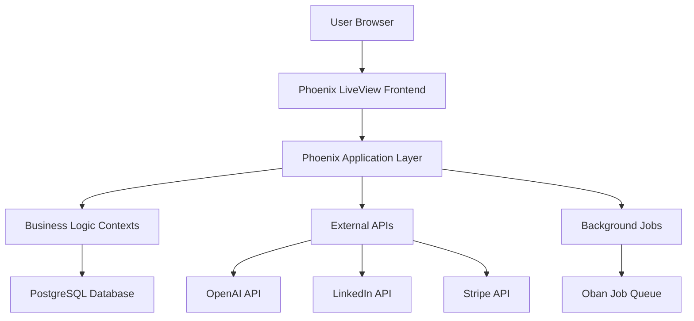

# Design Document

## Overview

The LinkedIn AI Enhancement platform will transform the existing Phoenix application into a comprehensive SaaS platform for LinkedIn optimization. The system will leverage OpenAI's GPT models for content generation, integrate with LinkedIn's API for profile analysis, implement Stripe for subscription management, and provide a modern, animated user experience built with Phoenix LiveView and Tailwind CSS.

## Architecture

### High-Level Architecture



### Technology Stack

- **Backend**: Phoenix Framework 1.7+ with Elixir
- **Frontend**: Phoenix LiveView with Alpine.js for animations
- **Database**: PostgreSQL with Ecto
- **Styling**: Tailwind CSS with custom animations
- **Background Jobs**: Oban for async processing
- **External APIs**: OpenAI GPT-4, LinkedIn API, Stripe
- **Deployment**: Docker with PostgreSQL
- **Monitoring**: Phoenix LiveDashboard, Telemetry

## Components and Interfaces

### Core Contexts

#### 1. Accounts Context (Enhanced)
- **Purpose**: User management with subscription tiers
- **Key Functions**:
  - User registration/authentication (existing)
  - Subscription management
  - Role-based access control (user, admin)
  - LinkedIn profile connection

#### 2. Subscriptions Context
- **Purpose**: Manage subscription tiers and billing
- **Key Functions**:
  - Stripe integration for payments
  - Subscription lifecycle management
  - Usage tracking and limits
  - Billing history

#### 3. ContentGeneration Context
- **Purpose**: AI-powered LinkedIn content creation
- **Key Functions**:
  - OpenAI API integration
  - Content template management
  - Usage tracking per subscription tier
  - Content history and favorites

#### 4. ProfileOptimization Context
- **Purpose**: LinkedIn profile analysis and improvement
- **Key Functions**:
  - LinkedIn API integration
  - Profile analysis algorithms
  - Improvement suggestions
  - Progress tracking

#### 5. Analytics Context
- **Purpose**: User engagement and performance tracking
- **Key Functions**:
  - Content performance metrics
  - Profile improvement tracking
  - Usage analytics
  - Report generation

#### 6. Admin Context
- **Purpose**: Administrative functions and monitoring
- **Key Functions**:
  - User management
  - Subscription analytics
  - System monitoring
  - Content moderation

### LiveView Components

#### 1. Dashboard LiveView
- Real-time metrics display
- Animated charts and progress bars
- Quick action buttons
- Subscription status indicator

#### 2. Content Generator LiveView
- Multi-step content creation wizard
- Real-time AI generation with loading states
- Content preview and editing
- Save/share functionality

#### 3. Profile Optimizer LiveView
- LinkedIn profile import interface
- Analysis results with before/after comparisons
- Interactive improvement suggestions
- Progress tracking dashboard

#### 4. Subscription Management LiveView
- Pricing tiers display
- Stripe checkout integration
- Billing history
- Usage metrics

#### 5. Admin Panel LiveView
- System metrics dashboard
- User management interface
- Subscription analytics
- Content moderation tools

## Data Models

### Enhanced User Schema
```elixir
schema "users" do
  field :email, :string
  field :hashed_password, :string
  field :confirmed_at, :utc_datetime
  field :role, Ecto.Enum, values: [:user, :admin], default: :user
  field :linkedin_profile_url, :string
  field :linkedin_access_token, :string # encrypted
  field :onboarding_completed, :boolean, default: false
  
  has_one :subscription, Subscription
  has_many :generated_contents, GeneratedContent
  has_many :profile_analyses, ProfileAnalysis
  
  timestamps()
end
```

### Subscription Schema
```elixir
schema "subscriptions" do
  field :stripe_subscription_id, :string
  field :stripe_customer_id, :string
  field :plan_type, Ecto.Enum, values: [:basic, :pro]
  field :status, Ecto.Enum, values: [:active, :canceled, :past_due, :unpaid]
  field :current_period_start, :utc_datetime
  field :current_period_end, :utc_datetime
  field :cancel_at_period_end, :boolean, default: false
  
  belongs_to :user, User
  has_many :usage_records, UsageRecord
  
  timestamps()
end
```

### Generated Content Schema
```elixir
schema "generated_contents" do
  field :content_type, Ecto.Enum, values: [:post, :comment, :message, :headline]
  field :prompt, :text
  field :generated_text, :text
  field :final_text, :text
  field :hashtags, {:array, :string}
  field :is_favorite, :boolean, default: false
  field :linkedin_post_id, :string # if posted to LinkedIn
  field :engagement_metrics, :map # likes, comments, shares
  
  belongs_to :user, User
  
  timestamps()
end
```

### Profile Analysis Schema
```elixir
schema "profile_analyses" do
  field :linkedin_data, :map # raw LinkedIn profile data
  field :analysis_results, :map # AI analysis results
  field :improvement_suggestions, {:array, :map}
  field :implemented_suggestions, {:array, :string}
  field :score_before, :integer
  field :score_after, :integer
  field :analysis_date, :utc_datetime
  
  belongs_to :user, User
  
  timestamps()
end
```

### Usage Record Schema
```elixir
schema "usage_records" do
  field :feature_type, Ecto.Enum, values: [:content_generation, :profile_analysis, :api_call]
  field :usage_count, :integer, default: 1
  field :usage_date, :date
  field :metadata, :map
  
  belongs_to :subscription, Subscription
  
  timestamps()
end
```

## Error Handling

### API Error Handling
- **OpenAI API**: Retry logic with exponential backoff, fallback to cached responses
- **LinkedIn API**: Rate limit handling, token refresh automation
- **Stripe API**: Webhook verification, idempotency handling

### User-Facing Errors
- Animated error messages with clear action steps
- Graceful degradation for API failures
- Offline capability for cached content

### System Errors
- Comprehensive logging with structured data
- Real-time error monitoring and alerting
- Automatic error recovery where possible

## Testing Strategy

### Unit Testing
- Context function testing with ExUnit
- Schema validation testing
- Business logic testing with mocks for external APIs

### Integration Testing
- LiveView integration tests
- Database transaction testing
- External API integration testing with VCR

### End-to-End Testing
- User journey testing with Wallaby
- Payment flow testing with Stripe test mode
- Admin panel functionality testing

### Performance Testing
- Load testing with concurrent users
- Database query optimization testing
- API response time monitoring

## Security Considerations

### Authentication & Authorization
- Phoenix's built-in authentication (existing)
- Role-based access control for admin features
- API key encryption for external services
- Session security with CSRF protection

### Data Protection
- Encryption at rest for sensitive data
- HTTPS enforcement in production
- LinkedIn API compliance
- GDPR compliance for EU users

### Payment Security
- PCI compliance through Stripe
- No direct credit card storage
- Webhook signature verification
- Secure API key management

## Performance Optimizations

### Database Optimizations
- Proper indexing for frequently queried fields
- Connection pooling configuration
- Query optimization with Ecto preloading
- Database migrations for schema changes

### Frontend Optimizations
- LiveView optimization with temporary assigns
- Asset optimization with esbuild and Tailwind
- Image optimization and lazy loading
- Progressive enhancement with Alpine.js

### Caching Strategy
- Redis for session storage and caching
- CDN for static assets
- Application-level caching for API responses
- Database query result caching

## Animation and UI Design

### Animation Framework
- CSS transitions and transforms with Tailwind
- Alpine.js for interactive animations
- Phoenix LiveView JS commands for server-driven animations
- Framer Motion-inspired animation patterns

### Design System
- Consistent color palette with dark/light mode support
- Typography scale with proper hierarchy
- Component library with reusable LiveView components
- Responsive design with mobile-first approach

### User Experience Patterns
- Loading states with skeleton screens
- Micro-interactions for user feedback
- Progressive disclosure for complex features
- Accessibility compliance (WCAG 2.1)

## Deployment and Infrastructure

### Development Environment
- Docker Compose for local development
- Hot reloading for rapid development
- Test database seeding scripts
- Environment variable management

### Production Environment
- Docker containerization
- PostgreSQL with connection pooling
- SSL termination with Let's Encrypt
- Health checks and monitoring
- Automated backups and disaster recovery

### CI/CD Pipeline
- Automated testing on pull requests
- Database migration verification
- Security scanning
- Automated deployment to staging/production